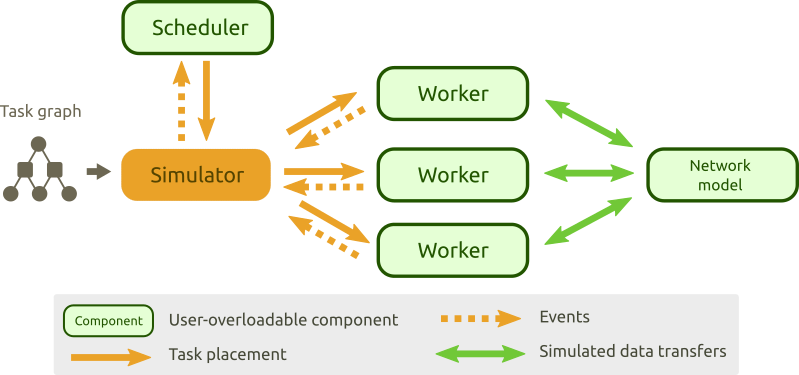
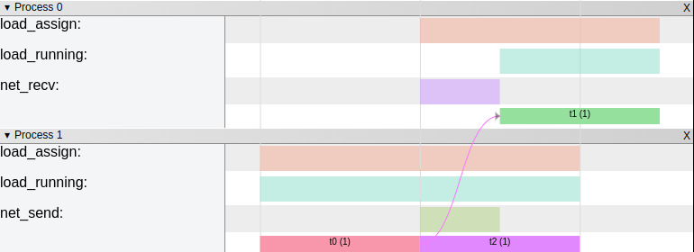

# Estee

Estee is a discrete event simulator for executing task graphs in distributed
environments. It is mainly designed for benchmarking and experimenting with
schedulers. Estee is created as an open-ended simulator; most of its
components can be extended or replaced by a custom implementation. It is
possible to experiment with different kinds of schedulers, workers, and network
models. Estee comes with battery-included and provides a standard
implementation for all its components.

## Achitecture



## Installation

```
python3 setup.py install
```

## Hello world example

The following example creates a simple task graph, instantiates a network model
and the simulator and executes the task with one of build-in schedulers.

```python
from estee.common import TaskGraph
from estee.schedulers import BlevelGtScheduler
from estee.simulator import Simulator, Worker, MaxMinFlowNetModel

# Create task graph containing 3 tasks
# (each task runs 1s and requires 1 CPU)
#
#     t0
#     | (50MB output)
#    / \
#  t1   t2
task_graph = TaskGraph()
t0 = task_graph.new_task(duration=1, cpus=1, output_size=50)
t1 = task_graph.new_task(duration=1, cpus=1)
t1.add_input(t0)
t2 = task_graph.new_task(duration=1, cpus=1)
t2.add_input(t0)

# Create B-level scheduler
scheduler = BlevelGtScheduler()

# Define cluster with 2 workers (1 CPU each)
workers = [Worker(cpus=1) for _ in range(2)]

# Define MaxMinFlow network model (100MB/s)
netmodel = MaxMinFlowNetModel(bandwidth=100)

# Create a simulator
simulator = Simulator(task_graph, workers, scheduler, netmodel, trace=True)

# Run simulation, returns the makespan in seconds
makespan = simulator.run()

# Print simulation time
print("Task graph execution makespan = {}s".format(makespan))

simulator.write_chrome_trace("trace.json")
```

### Displying trace.json in Chrome profiler



## Built-in implementations

### Built-in schedulers

 * Blevel (HLFET)
 * DLS
 * ETF
 * LAST
 * MCP
 * Simple genetic algorithm based scheduler
 * Simple work stealing scheduler
 * Camp2

### Build-in network models

  * MaxMin flow model (MaxMinFlowNetModel)
  * All downloads runs at full speed (SimpleNetModel)
  * Instant communication (InstantNetModel)